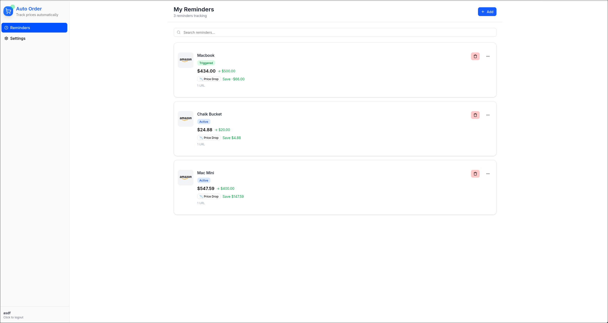

# Timely Buyer
Track sales on your favorite items, all in one place!



## Motivation

Online shoppers often come across products they want but prefer to wait for a sale before purchasing. This project was built to centralize and track those "wait-for-a-sale" items in one place. Users can register products, set a target price, and receive a notification when the item's price drops below their specified threshold — helping them buy at the right time without constantly checking for deals.

## How It Works

After a user has registered, they have the ability to create 'product reminders' in the home page. Here, one can enter a URL for the product and set a target price to receive a notification. Our service then fetches the price from the provided URL and uses that information to populate the entry in the home page. Then, on regular intervals, Timely Buyer will check the current price of the item. If the current price has dropped below the user-specified target price, a notification is sent to the user's email!

## Quick Start

Super quick start: https://timely.tier-zero.co.uk/
- Register with any (even fake) email
- Note: When you add a product reminder we scrape Amazon.com for it's price. **It's not 100 % reliable, sorry for that!** In case we fail to scrape, we won't add item to the list.
- hosted on Google Cloud Platform
- SSL by Let's Encrypt


To quickly setup the application locally, follow these steps. Alternatively, if you are looking to set the project up for development, see the *Development Steps* section.
1. Install modern docker (or docker-compose) on your machine.
2. Clone the repository:
    ```bash
    git clone https://github.com/the-vindex/auto-order.git
   ```
3. Navigate to the project directory:
    ```bash
    cd auto-order
    ```
4. Copy over test.env.example to test.env:
    ```bash
    cp test.env.example test.env
    ```
5. Set up JWT Secret, used for creating JWTs:
6. ```bash
    echo JWT_TOKEN=your_secret_key > jwt.secret
    ```
7. (OPTIONAL) Set Up Resend Account
   To receive email notifications in development, a resend api key is needed. Go to resend.com, create an account, and get an API key. Use this api key in your .env file, as RESEND_API_KEY. Ensure the email you use when tseting this app is the same one you use to create your resend account.

8. Start the application using script below.
    ```bash
    ./start-stop.sh --test
    ```
   
    If you use Rootless Docker, you will need this - drop a file to allow user binding ports below 1024:
    ```bash
    sudo echo 'net.ipv4.ip_unprivileged_port_start = 80' > /etc/sysctl.d/99-unprivileged-ports.conf
    sudo sysctl --system
    ```
   
7. Open your browser at https://localhost


## Development Setup
### Database Setup

1.  Navigate to the backend directory:


### Backend Development

1.  Navigate to the backend directory:
    ```bash
    cd auto-order/backend
    ```
2.  Create a `.env` file from the example. This file will hold your local environment variables, including the database URL and JWT secret.
    ```bash
    cp .env.example .env
    # Edit .env with your local database connection string and JWT_SECRET
    ```
3.  Start the database with docker compose:
   ```bash
   docker compose up -d
   ```
3.  Install backend dependencies:
    ```bash
    npm install
    ```
4.  Start the backend in development mode:
    ```bash
    npm run dev
    ```
    The backend will run on `http://localhost:3000` (or the port specified in your `.env`).

### Frontend Development

1.  Navigate to the React frontend directory:
    ```bash
    cd auto-order/react
    ```
2.  Install frontend dependencies:
    ```bash
    npm install
    ```
3.  Start the frontend development server:
    ```bash
    npm run dev
    ```
    The frontend will typically run on `http://localhost:5173`.

## Tech Stack

*   **Backend:** Node.js, Express.js
*   **Frontend:** React
*   **Database:** PostgreSQL
*   **Containerization:** Docker
